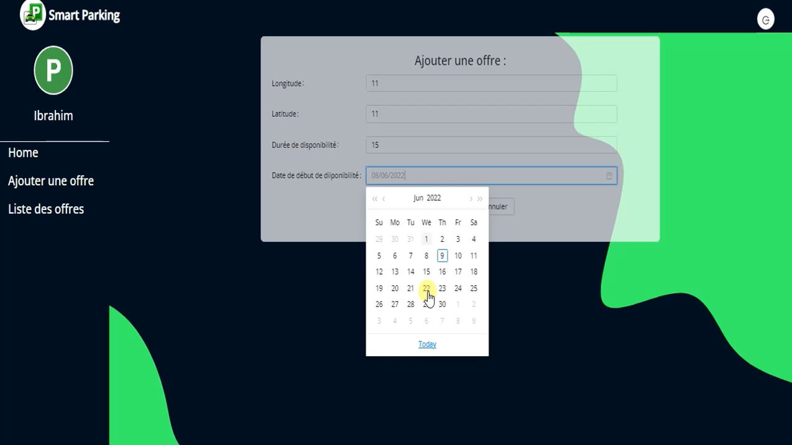

# SmartParking 🚗🅿️

SmartParking is an innovative solution for managing parking spaces using blockchain and AI technologies. This system ensures secure, transparent, and efficient parking management, optimizing space utilization and enhancing user experience.

## Demo Video 🎥

[Download or view the SmartParking demo video](./video/Untitled1.mp4)

## Demo Slides 🖼️

  

    
  

  

    
  

  

    
  

  

